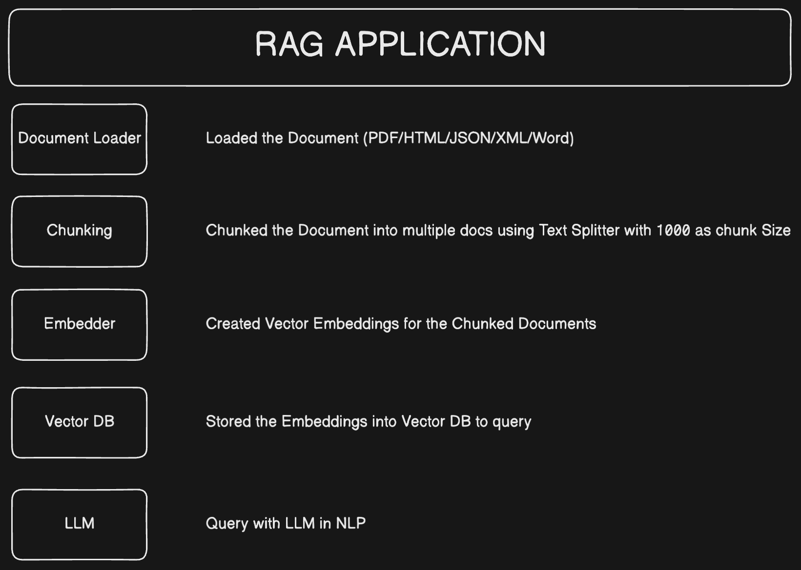

# Smart PDF Search: AI Search with LangChain, Vector DB (Qdrant) & RAG-Based Retrieval 

This project enables you to **query PDF documents** using natural language, powered by **LangChain** and **Google GenAI**, with **Qdrant** as the vector database. It is designed for efficient extraction, processing, and searching of information from PDF files.

---

## ✨ Features

- **Natural Language Querying**: Search PDFs using simple natural language prompts.
- **Advanced AI Processing**: Powered by **LangChain** and **Google GenAI**.
- **Efficient Vector Storage**: Store and retrieve document embeddings with **Qdrant**.
- **Flexible Setup**: Supports installation with both `uv` and `pip`.

---

## ⚙️ Prerequisites

- Python **3.13** or higher
- Docker and Docker Compose installed

---

## 🚀 Setup Instructions

### 1. Clone the Repository
```bash
git clone https://github.com/aryany9/pdf_query_langchain.git
cd pdf_query_langchain
```

---

### 2. Install Project Dependencies

You have **two options**:

#### Option 1: Install using `uv`
*(Recommended for cleaner and faster dependency management)*

```bash
uv sync
```

#### Option 2: Install using `pip`
If you prefer using `pip`, install dependencies from `pyproject.toml` manually:
```bash
pip install -r requirements.txt
```
> **Note**: You can generate a `requirements.txt` from `pyproject.toml` if needed, or directly install the listed libraries.

Example for manual installation:
```bash
pip install python-dotenv google-genai langchain-community langchain-google-genai langchain-qdrant pypdf
```

---

### 3. Add Your PDF Files
Place your PDF files inside the `data/` directory:
```
data/
  └── little_red_riding_hood.pdf
```

---

### 4. Launch Qdrant Vector Database
Start Qdrant using Docker Compose:
```bash
docker-compose up
```
Dashboard: [http://localhost:6333/dashboard](http://localhost:6333/dashboard)

---

### 5. Set Environment Variables
1. Create a `.env` file at the project root.
2. Add your **Gemini API Key**:
```
GEMINI_API_KEY=your_gemini_api_key_here
```

---

### 6. Run the Application

You can run the app using either method:

#### If using `uv`
```bash
uv run main.py
```

#### If using `python` directly
```bash
python -m main
```

---

## 🛠 Usage

Upon starting, you will be prompted with two options:
- **store**: Store PDF embeddings into Qdrant.
- **ask**: Search your stored PDFs using natural language questions powered by Gemini AI.

Just type `store` or `ask` accordingly!

---

## 📁 Project Structure

```
.
├── data/                     # Folder to store your PDF files
├── docker-compose.yml        # Docker Compose configuration for Qdrant
├── main.py                   # Main application script
├── pyproject.toml            # Project configuration and metadata
├── README.md                 # Project documentation
├── uv.lock                   # Dependency lock file (for uv users)
```
---

## 📊 Workflow Overview

Refer to the following diagram for a visual representation of the workflow:



---

## 📦 Key Dependencies

- **LangChain** (`langchain`, `langchain-community`)
- **Google GenAI** (`google-genai`, `langchain-google-genai`)
- **PDF Parsing** (`pypdf`)
- **Environment Management** (`dotenv`)
- **Vector Database Integration** (`langchain-qdrant`)

*See `pyproject.toml` and `uv.lock` for the full list.*

---

## 📜 License

This project is licensed under the **MIT License**.  
See the `LICENSE` file for more information.

---

## 🤝 Contributing

Contributions are welcome!  
Please feel free to **open an issue** or **submit a pull request** for enhancements, bug fixes, or documentation improvements.

---
